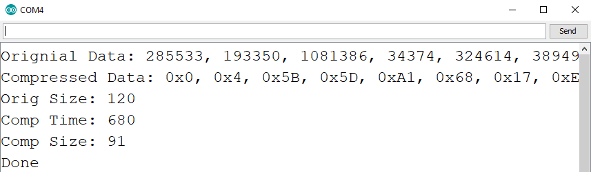
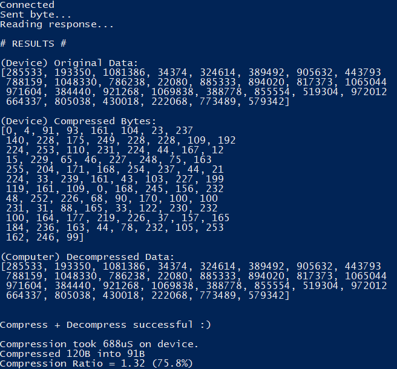

# RDES Example Use-Case: Embedded Sensor Logging

This directory contains an implementation of a sample scenario, where an embedded device compresses some data using RDES, stores it, then sends it to a computer for decompression again.

*Disclaimer: This example, particularly the `reader.py` file, are not implemented in the cleanest way possible. The primary goal was to provide a functioning proof-of-concept. Also note that you must also ensure that `rdes.py` and `byteTools.py` are in the same directory as `reader.py` for it to function.*

The "embedded device" in this scenario is anything that can be programmed through the Arduino IDE, and has some form of USB-Serial support. You can test this yourself by using the `EmbeddedExample.ino` sketch file.

The device takes a fixed-array of demo data (30 x uint32_t), compresses them using RDES2, then stores the data in an array. Upon receiving any serial data (e.g. a byte) from another device, it sends the original data, compressed bytes, and compression time over serial. An example readout (produced by a 16MHz Arduino Uno) over serial can be seen below;

The `reader.py` program can be used to capture this data (assuming the correct COM port & baud rates are provided), and then attempt decompression of the bytes. It then compares the decompressed data with the original data (according to the device), and states if they match. Additionally, it displays statistics such as the compression ratio and compression time. An example readout from `reader.py` is shown below;

In this example the data is a fixed size, and is nearly-instantly transmitted to the computer. In a real-world application the data would be generated dynamically (e.g. the output of a sensor), and would be stored for much longer (perhaps in non-volatile memory) before eventually being sent to a computer.