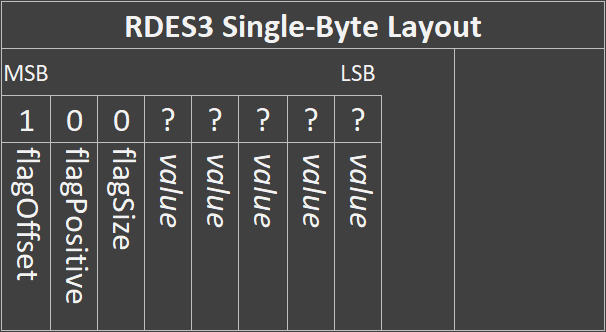

# Real-time Deviation Encoding Scheme

Disclaimer: This is a very simple concept; I am absolutely not the first person to come up with this idea.


## Overview
- Real-time lossless compression algorithm for sequences of integers
- 31-bit value storage (signed or unsigned)
- Incredibly lightweight compression function
- Compression ratio of 1.0 to 4.0 (depending on variant)
- Three variants, each optimized for different scenarios
- Python demo implementations provided
- Real-world usage demo in Python & C provided

## Table of Contents

1. [Introduction](#introduction)
2. [Creation](#creation)
3. [Variants](#variants)
4. [Theory](#theory)
5. [Implementation](#implementation)
6. [Benchmarks](#benchmarks)
7. [Detailed Algorithms](#detailed-algorithms)


# Introduction
Real-time Deviation Encoding Scheme (RDES) is a simple, lossless, real-time compression algorithm for sequences of 32-bit integers. It is optimized to have an extremely lightweight compression process (good for low-power embedded systems), while still maintaining an appealing compression ratio (4.0 in the best case, 1.0 in the worst case).

The sacrifice for the extreme light-weight is the maximum storable number; a 3**1**-bit value, as opposed to a standard 32-bit value. This means it can store values from 0 to 2,147,483,647 (unsigned), or -1,073,741,823 to +1,073,741,823 (signed). Due to the nature of the deviation encoding, values may exceed these limits (so long as they're not the initial values) up to the maximum value supported by the device running the decompression. Storing values exceeding this range results in undefined behaviour.

The core concept is simple; when storing a sequence of numbers, storing just the change between each value results in much smaller values than the original data. These smaller values may then be stored in a fewer number of bytes, reducing the storage required. This technique proves very effective when the sequence of numbers varies by small amounts.

This repository serves as a technical explanation of the algorithm, a guideline for implementation, and easily-testable code with benchmarks.

- The `rdes.py` file provides a demo implementation of RDES in Python 3.8. Executing this file gives a small demo.
- The `benchmark.py` file runs a series of benchmarks on the `rdes.py` implementation - results can be found in a later section.
- The `EmbeddedExample` directory contains an example use-case between an Arduino-like device and a computer.


# Creation
RDES is intended for use on low-power embedded logging hardware, where the time and complexity of the compression algorithm must be limited. The decompression algorithm would be run on an external device (such as a laptop computer), so the decompression algorithm does not have the same constraints.

The need for an algorithm such as this arose while I was working on an embedded hardware project - the device must record various numeric sensor values (uint32) at a fast rate (~20Hz) for as long as possible, but the hardware only has 4MiB of flash storage available to do so. My goal was to create a compression scheme which was lightweight and efficient (as to not impede the fast logging rate), while still achieving a moderate compression ratio for data while still being lossless. Due to the real-time nature of sensor logging, as well as the limited memory and processing power available, the algorithm would have to be able to operate with little context of the entire dataset.

After a few days of playing around with ideas, I came up with RDES. The idea is absolutely *not* novel (storing the changes of values rather than the value itself each iteration is actually a common practice), but I was not able to find an implementation that met my goal of lightweight and real-time compression.


# Variants
There are three variants of RDES; RDES1, RDES2, and RDES3. The number denotes the number of potential levels of compression a uint32 can be stored as; 1-byte, 2-bytes, or 3-bytes. RDES1 can only compress values to 3 bytes, whereas RDES3 could compress values to 1, 2, *or* 3 bytes. Each variant has its own strengths and weaknesses relating to peak compression ratio, efficiency, and performance with different ranges of values. Below is a brief summary of each;

| Variant | Peak Compression Ratio | Compression Speed | Optimized For
| ------------- | ------------- | ------------- | ------------- |
| RDES1 | 1.33 (75%)  | Fastest* | Significant variations in data; ±10<sup>6</sup>
| RDES2 | 2.00 (50%)  | Faster* | Moderate variations in data; ±10<sup>3</sup>
| RDES3 | 4.00 (25%)  | Fast* | Small variations in data; ±10<sup>1</sup>

\**theoretically; differences are very minor regardless*

Benchmarks for each algorithm can be found in a later section.


# Theory
To make the RDES scheme as intuitive as possible, an example highlighting many of the components of the algorithm is provided below.

Let us assume we're sampling a single sensor over time - we have to store several 32-bit integers over time. As the value of the sensor should never approach the maximum value of a 32-bit storage space, the RDES algorithm should work. The data would be stored on a flash module or in an array. For this example, the data will be presented in a table format. Below is a sample of data recorded in a table.

| Timestamp  | Binary Value (uint32) | Decimal Value | Value Change
| ------------- | ------------- | ------------- | ------------- |
| 1             | 01000100 01011100 00110001 01110001  | 1146892657 | 
| 2             | 01000100 01011100 00110101 01011001  | 1146893657 | + 1000
| 3             | 01000100 01011100 00101011 10010101  | 1146891157 | - 2500

While we are storing large values each timestep, the actual number of binary data changing between readings is quite small. Instead of storing the entire number each timestep, we can just store how much the value has changed since the previous reading (aka. the deviation). Doing so, we get the following table:

| Timestamp  | Binary Value (uint32) | Decimal Value
| ------------- | ------------- | ------------- |
| 1             | 01000100 01011100 00110001 01110001  | 1146892657
| 2             | 00000000 00000000 00000011 11101000  | 1000
| 3             | 00000000 00000000 00001001 11000100  | 2500

It is now very clear that the first two bytes of reading 2 and 3 are effectively unused. To improve storage efficiency, we can simply avoid storing these bytes, effectively compressing our data. The number of bytes we can discard depends on how big of a change there has been from the last value (larger changes consuming more bytes). If all four bytes are used in an offset, we can simply store the raw value instead.

Simply discarding "unused" bytes creates several problems, however.

**The first issue** is, when decompressing the data, how can one differentiate between a uint32 (4 bytes) and an offset value (1-3 bytes)? This is where the 31-bit limitation comes in; the most significant bit (MSB) of a 32-bit value is allocated as a "type" flag bit - "0" means it is the start of a 4-byte uint32, while "1" means it is the start of an offset value from the previous value.

**The second issue** is that we currently only store the magnitude of the offset - we need to store its sign too, depending on if the value has increased or decreased since the last recorded value. When storing an offset, we allocate the second MSB as a "sign" flag bit - "0" means subtraction, "1" means addition.

In order to achieve the best compression ratio, we want to use as few bits as possible. For simplicity, the storage size of an offset in RDES is always a whole number of bytes (1,2,3), or equivalently a multiple of 8 bits (8, 16, 24). A greater compression ratio could be achieved by using more granular numbers of bits (e.g. only 12 instead of 16 for one value), but this would increase complexity more than I am willing to sacrifice.

**The third issue** is that, if the number of bytes per offset value can vary, how can we tell how many bytes to read per offset when decoding? We must also encode the length in each offset so we can decode them appropriately. Depending on the variant of RDES, this can range from 1 to 3 bytes. The 3rd, and sometimes 4th, MSB is allocated to storing the number of bytes the offset consumes. For RDES3, "0*" denotes "1 byte", "10" denotes "2 bytes", "11" denotes "3 bytes". For RDES2, "0" denotes "2 bytes", and "1" denotes "3 bytes". RDES1 always uses 3-byte for storing offsets, and thus does not need a size flag.

These flag bits reduce the number of bits available for storing the offset value itself. As we have a maximum of 4 flag bits, they are all found in the first byte of an offset value, meaning any remaining bytes can be completely dedicated to storing the offset value. By reducing the number of sizes an offset value can be (e.g. 1,2,3 bytes), we can reduce the number of bits allocated to storing size. This is the primary difference between RDES variants.

Below is a condensed set of information about the bit allocation schemes for RDES1, RDES2, and RDES3.


---
## **Uncompressed uint32 Bit Allocation**


No compression applied; the first bit being "0" just means this is a regular uint32. This gives 31 bits for value storage.

| Bytes  | Bits | FlagBits | ValueBits | MaxValue
| --- | --- | --- | --- | --- 
| 4   |  32 |  1  |  31 | 2147483647 (2<sup>31</sup>-1)


---
## **RDES1 Bit Allocation**


The first bit denotes this is an offset value, the second bit denote an addition, and the remaining six bits can be used to store part of the offset. The following two bytes will store the rest of the value, giving a total of 22 bits for storage. As offsets always consume 3 bytes, no bit needs to be allocated for storing size.

| Bytes  | Bits | FlagBits | ValueBits | MaxValue
| --- | --- | --- | --- | --- 
| 3   |  24 |  2  |  22 | 4194303 (2<sup>22</sup>-1)


---
## **RDES2 Bit Allocation**


The first bit denotes this is an offset value, the second bit denotes an addition, the third bit denotes size ("0" = 2 bytes, "1" = 3 bytes), and the remaining five bits can be used to store part of the offset. The following one to two bytes will store the rest of the value, giving either 13 or 21 bits for storage.

| Bytes  | Bits | FlagBits | ValueBits | MaxValue
| --- | --- | --- | --- | --- 
| 2   |  16 |  3  |  13 | 8191 (2<sup>13</sup>-1)
| 3   |  24 |  3  |  21 | 2097151 (2<sup>21</sup>-1)


---
## **RDES3 Bit Allocation**



The first bit denotes this is an offset value, and the second bit denotes a subtraction. The third and fourth bits denote size ("0*" = 1 byte, "10" = 2 bytes, "11" = 3 bytes). If the third bit is "0", this means a size of one byte, and the 4th bit is then allocated to storing value information instead of size. The remaining four or five bits can be used to store part of the offset. If size is two or three bytes, the following one or two bytes will store the rest of the value. This gives either 5, 12, or 20 bits for storage.

| Bytes  | Bits | FlagBits | ValueBits | MaxValue
| --- | --- | --- | --- | --- 
| 1   |  8  |  3  |  5 | 31 (2<sup>5</sup>-1)
| 2   |  16 |  4  |  12 | 4095 (2<sup>12</sup>-1)
| 3   |  24 |  4  |  20 | 1048575 (2<sup>20</sup>-1)

---

This storage scheme is still not perfect.

Firstly, signed values usually use the MSB to denote sign, so by overwriting that we break signed functionality. To store signed values in this scheme, we must convert them to unsigned (positive values). This means that the range of -1,073,741,823 to +1,073,741,823 is actually stored as 0 to 2,147,483,646.

Secondly, the nature of having each value dependent on the previous one makes this algorithm susceptible to mass corruption. To reduce the effects of this, the compression algorithm can be configured to periodically force-store the raw, uncompressed value every so many iterations. While this reduces compression efficiency, it improves corruption resistance. The negative effects of this could be reduced by only force-storing the raw value after X iterations without saving it, rather than just every X iterations no matter how long it has been since it was last recorded raw. If you are in a scenario where corruption is not a concern (e.g. compress & decompress running on same device, data stored in memory), then this can be disabled by setting the interval to "0".


# Implementation

Note: The implementations in this repository are built for handling tables of data; several sets of integer sequences (columns), however the core algorithm can be applied to a single sequence of integers just as easily.

An implementation of RDES can be found in the `rdes.py` file. It contains two classes;

## RDESCompressor()
Usage: **RDESCompressor(variant, numCols, verbose, originRefreshInterval)**
- `variant` may be `1`, `2`, or `3`.
- `numCols` is the number of columns in the virtual table.
- `verbose` is for debugging, should be `False` most of the time.
- `originRefreshInterval` is for corruption resistance; if this is not a concern, set to `0`.

Use `writeCompressedRow()` to write a row to the virtual table. It requires an array of data of length `numCols`. If storing signed values, you must run them through `unsignify()` first. When done, you can acquire the compressed data bytes using `getCompressedData()`. You can reset the compressor using `reset()`. Statistics like uncompressed size, compressed size, and compression ratio are available through accessors.


## RDESDecompressor()
Usage: **RDESDecompressor(variant, numCols, verbose, signedCols)**
- `variant` may be 1, 2, or 3.
- `numCols` is the number of columns in the virtual table.
- `verbose` is for debugging, should be `False` most of the time.
- `signedCols` is an optional list of column indexes which should automatically be converted to signed values.

Variant, column, and signify settings must match those of the compressor, or else decompression will not work correctly. You may feed an array of compressed bytes into the `decompress()` function to decompress the data. If you are storing signed values, and did not configure the `signedCols` argument, then you must use `resignify()` to convert the encoded values back to signed values. Statistics like uncompressed size, compressed size, and compression ratio are available through accessors.


# Benchmarks

The `benchmark.py` file runs a series of tests on all variants of RDES, allowing comparison between them. The summarized results of running this file on my machine are provided below.

**Note**: The compression/decompression time results have a very high margin of error, due to how fast all three variants are. For all but the most time-critical scenarios, the time requirements for all three variants are effectively equal.


**Compression Ratio TLDR**:
- RDES3 works best when values vary less than 2<sup>13</sup>
- RDES2 works best when values vary between 2<sup>13</sup> and 2<sup>21</sup>
- RDES1 works best when values vary more than 2<sup>21</sup>

**Compression/Decompression Time TLDR**:
- Higher variation in data generally means longer compression time
- All variants perform very similarly

## Compression Ratio: Linear Increments

10000 rows per test. Very "sterile" environment; not very reflective of real world.

<details>
<summary><b>TABLE: Results</b></summary>

| Increment  | RDES1 | RDES2 | RDES3 | Best
| --- | --- | --- | ---	| ---
| 2<sup>4</sup>  | 1.333 | 2.000 | 3.999 | RDES3
| 2<sup>5</sup>  | 1.333 | 2.000 | 2.000 | -
| 2<sup>11</sup>  | 1.333 | 2.000 | 2.000 | -
| 2<sup>12</sup>  | 1.333 | 2.000 | 1.333 | RDES2
| 2<sup>13</sup>  | 1.333 | 1.333 | 1.333 | -
| 2<sup>19</sup>  | 1.333 | 1.333 | 1.333 | -
| 2<sup>20</sup>  | 1.333 | 1.333 | 1.000 | -
| 2<sup>21</sup>  | 1.333 | 1.000 | 1.000 | RDES1
| 2<sup>22</sup>  | 1.000 | 1.000 | 1.000 | -

</details>

---

## Compression Ratio: Random Increments

10000 rows per test. More reflective of real-world data.

<details>
<summary><b>TABLE: Results</b></summary>

| Max Increment  | RDES1 | RDES2 | RDES3 | Best
| --- | --- | --- | --- | --- 
| 2<sup>4</sup>  | 1.333 | 2.000 | 3.999 | RDES3
| 2<sup>5</sup>  | 1.333 | 2.000 | 3.999 | RDES3
| 2<sup>6</sup>  | 1.333 | 2.000 | 3.194 | RDES3
| 2<sup>7</sup>  | 1.333 | 2.000 | 2.550 | RDES3
| 2<sup>8</sup>  | 1.333 | 2.000 | 2.261 | RDES3
| 2<sup>9</sup>  | 1.333 | 2.000 | 2.133 | RDES3
| 2<sup>10</sup>  | 1.333 | 2.000 | 2.062 | RDES3
| 2<sup>11</sup>  | 1.333 | 2.000 | 2.032 | RDES3
| 2<sup>12</sup>  | 1.333 | 2.000 | 2.013 | RDES3
| 2<sup>13</sup>  | 1.333 | 2.000 | 1.789 | RDES2
| 2<sup>14</sup>  | 1.333 | 1.778 | 1.564 | RDES2
| 2<sup>15</sup>  | 1.333 | 1.558 | 1.446 | RDES2
| 2<sup>16</sup>  | 1.333 | 1.445 | 1.389 | RDES2
| 2<sup>17</sup>  | 1.333 | 1.391 | 1.362 | RDES2
| 2<sup>18</sup>  | 1.333 | 1.362 | 1.348 | RDES2
| 2<sup>19</sup>  | 1.333 | 1.346 | 1.340 | RDES2
| 2<sup>20</sup>  | 1.333 | 1.340 | 1.337 | RDES2
| 2<sup>21</sup>  | 1.333 | 1.337 | 1.231 | RDES2
| 2<sup>22</sup>  | 1.333 | 1.233 | 1.125 | RDES1
| 2<sup>23</sup>  | 1.228 | 1.122 | 1.061 | RDES1
| 2<sup>24</sup>  | 1.123 | 1.063 | 1.031 | RDES1

</details>

---


## Compression/Decompression Time: Linear Increments

500000 rows per test. Times are in milliseconds. Very "sterile" environment; not very reflective of real world. Note the margin of error on these readings is very high.

<details>
<summary><b>TABLE: Results</b></summary>

| Increment  | RDES1 | RDES2 | RDES3
| --- | --- | --- | ---
| 10<sup>1</sup>  | 781,990   | 738,1167 | 635,1297
| 10<sup>2</sup>  | 1072,1153 | 937,1412 | 899,1564
| 10<sup>3</sup>  | 874,1047  | 797,1366 | 862,1439
| 10<sup>4</sup>  | 898,1216  | 862,1168 | 954,1451
| 10<sup>5</sup>  | 799,1054  | 860,1281 | 886,1459
| 10<sup>6</sup>  | 800,1139  | 872,1405 | 906,1729
| 10<sup>7</sup>  | 863,800   | 1044,822 | 879,794
| 10<sup>8</sup>  | 854,784   | 828,810  | 880,763

</details>

---

## Compression/Decompression Time: Random Increments

500000 rows per test. Times are in milliseconds. More reflective of real-world data. Note the margin of error on these readings is very high.

<details>
<summary><b>TABLE: Results</b></summary>

| Max Increment  | RDES1 | RDES2 | RDES3
| --- | --- | --- | ---
| 10<sup>1</sup>  | 809,994  |  828,1198  | 697,1318
| 10<sup>2</sup>  | 881,1220  |  794,1208  | 784,1371
| 10<sup>3</sup>  | 863,1112  |  784,1322  | 793,1535
| 10<sup>4</sup>  | 868,1132  |  794,1259  | 894,1686
| 10<sup>5</sup>  | 883,1104  |  993,1286  | 988,1661
| 10<sup>6</sup>  | 860,1292  |  1002,1337 | 985,1536
| 10<sup>7</sup>  | 820,1107  |  922,1060  | 895,974
| 10<sup>8</sup>  | 872,1312  |  996,1040  | 1086,1155

</details>

---

# Detailed Algorithms

Below are detailed pseudocode implementations of the RDES algorithm for a single sequence of integers. RDES1, RDES2, and RDES3 are all very similar, with only minor differences in how bits are allocated.

Note: These algorithms cannot handle signed values. An offset of `((2^30)-1)//2` must be applied before being compressed, and removed after the value was decompressed. See the implementation in `rdes.py` for an example of this.

When referring to a bit within a byte, the following naming convention is used:

```
MSB                         LSB
 0   0   0   0   0   1   1   1		= 7 (dec)
B8  B7  B6  B5  B4  B3  B2  B1
```


## RDES1 Algorithm

<details>
<summary><b>Compression Algorithm</b></summary>

```
# Inputs / Outputs
input = 0 		# The incoming input value (passed as argument)
compressedData = [] # Persistent array or other storage method

# Constants
const LVL_3_MAX = (2^22)-1 	# 22 bits

# Local Variables
initialized = False # If first value has been encoded
lastVal = 0 	# Last processed value

# Determine sign of offset
add = False
if (lastVal > input): add = True

# Determine magnitude of offset
offset = abs( lastVal - input )

# Determine if compression is possible
lvl = 4
if (offset <= LVL_3_MAX): lvl = 3

# Check if should store uncompressed value
if (lvl == 4 or not initialized):
	
	byte1 = 0b01111111 & ( input >> 24 ) # Set Bit8 = 0
	byte2 = byte( input >> 16 )
	byte3 = byte( input >> 8 )
	byte4 = byte( input )
	
	// write byte1, byte2, byte3, byte4 to compressedData
	
	lastVal = input
	initialized = True
	return

# Generate 3 compressed bytes

# Bit8 = 1 (offset)
byte1 = 0b11000000 | offset >> 16 	# Captures D22 to D17
byte2 = byte( offset >> 8 ) 		# Captures D16 to D09
byte3 = byte( offset ) 				# Captures D08 to D01

# Bit7 = add (0 = subtract)
if (not add): byte1 = byte1 & 0b10111111

// write byte1, byte2, byte3 to compressedData

lastVal = input
return
```

</details>


<details>
<summary><b>Decompression Algorithm</b></summary>

```
# Inputs / Outputs
compressedData = []
decompressedData = []

# Local Variables
lastVal = 0

position = 0
while (position < size of compressedData):

	# Read first byte
	byte1 = compressedData[position]

	# Check if uint32 or offset
	if (Bit8 == 0): # uint32
		# Read remaining bytes
		byte2 = compressedData[position+1]
		byte3 = compressedData[position+2]
		byte4 = compressedData[position+3]
		position += 4

		lastVal = (byte1 << 24) + (byte2 << 16) + (byte3 << 8) + byte4
		// write lastVal to decompressedData

	else: # offset
		# Decode sign
		add = False
		if (Bit7 == 1): add = True
		
		# Decode length
		size = 2 if (Bit6 == 0) else 3
		
		# Recover offset from 3 bytes
		byte1 = byte1 & 0b00111111 # Mask out 2 flag bits
		byte2 = compressedData[position+1]
		byte3 = compressedData[position+2]
		position += 3
		offset = (byte1 << 16) + (byte2 << 8) + byte3

		# Calculate value
		if (not add): offset = -offset
		lastVal += offset
		// write lastVal to decompressedData
```

</details>

---

## RDES2 Algorithm


<details>
<summary><b>Compression Algorithm</b></summary>

```
# Inputs / Outputs
input = 0 		# The incoming input value (passed as argument)
compressedData = [] # Persistent array or other storage method

# Constants
const LVL_2_MAX = (2^13)-1 	# 13 bits
const LVL_3_MAX = (2^21)-1 	# 21 bits

# Local Variables
initialized = False 	# If first value has been encoded
lastVal = 0 			# Last processed value

# Determine sign of offset
add = False
if (lastVal > input): add = True

# Determine magnitude of offset
offset = abs( lastVal - input )

# Determine how many bytes compression will yield
lvl = 4
if (offset <= LVL_2_MAX): lvl = 2
elif (offset <= LVL_3_MAX): lvl = 3

# Check if should store uncompressed value
if (lvl == 4 or not initialized):
	
	byte1 = 0b01111111 & ( input >> 24 ) # Set Bit8 = 0
	byte2 = byte( input >> 16 )
	byte3 = byte( input >> 8 )
	byte4 = byte( input )
	
	// write byte1, byte2, byte3, byte4 to compressedData
	
	lastVal = input
	initialized = True
	return

# Generate compressed bytes
if (lvl == 2):
	# Compute 2 compressed bytes
	
	# Bit8 = 1 (offset)
	byte1 = 0b11100000 | offset >> 8 	# Captures D13 to D09
	byte2 = byte( offset ) 				# Captures D08 to D01
	
	# Bit7 = add (0 = subtract)
	if (not add): byte1 = byte1 & 0b10111111
	
	# Bit6 = size (0 = 2Byte)
	byte1 = byte1 & 0b11011111

	// write byte1, byte2 to compressedData

	lastVal = input
	return

elif (lvl == 3):
	# Compute 3 compressed bytes
	
	# Bit8 = 1 (offset)
	byte1 = 0b11100000 | offset >> 16 	# Captures D21 to D17
	byte2 = byte( offset >> 8 ) 		# Captures D16 to D09
	byte3 = byte( offset ) 				# Captures D08 to D01

	# Bit7 = add (0 = subtract)
	if (not add): byte1 = byte1 & 0b10111111
	
	# Bit6 = size (1 = 3Byte, already set)

	// write byte1, byte2, byte3 to compressedData

	lastVal = input
	return
```

</details>

<details>
<summary><b>Decompression Algorithm</b></summary>

```
# Inputs / Outputs
compressedData = []
decompressedData = []

# Local Variables
lastVal = 0

position = 0
while (position < size of compressedData):

	# Read first byte
	byte1 = compressedData[position]

	# Check if uint32 or offset
	if (Bit8 == 0): # uint32
		# Read remaining bytes
		byte2 = compressedData[position+1]
		byte3 = compressedData[position+2]
		byte4 = compressedData[position+3]
		position += 4

		lastVal = (byte1 << 24) + (byte2 << 16) + (byte3 << 8) + byte4
		// write lastVal to decompressedData

	else: # offset
		# Decode sign
		add = False
		if (Bit7 == 1): add = True
		
		# Decode length
		size = 2 if (Bit6 == 0) else 3
		
		# Read remaining bytes
		byte1 = byte1 & 0b00011111 # Mask out 3 flag bits
		if (size == 2):
			# Recover offset from 2 bytes
			byte2 = compressedData[position+1]
			position += 2
			offset = (byte1 << 8) + byte2
		else:
			# Recover offset from 3 bytes
			byte2 = compressedData[position+1]
			byte3 = compressedData[position+2]
			position += 3
			offset = (byte1 << 16) + (byte2 << 8) + byte3

		# Calculate value
		if (not add): offset = -offset
		lastVal += offset
		// write lastVal to decompressedData
```

</details>


---

## RDES3 Algorithm


<details>
<summary><b>Compression Algorithm</b></summary>

```
# Inputs / Outputs
input = 0 		# The incoming input value (passed as argument)
compressedData = [] # Persistent array or other storage method

# Constants
const LVL_1_MAX = (2^5)-1 	# 5 bits
const LVL_2_MAX = (2^12)-1 	# 12 bits
const LVL_3_MAX = (2^20)-1 	# 20 bits

# Local Variables
initialized = False # If first value has been encoded
lastVal = 0 	# Last processed value

# Determine sign of offset
add = False
if (lastVal > input): add = True

# Determine magnitude of offset
offset = abs( lastVal - input )

# Determine how many bytes compression will yield
lvl = 4
if (offset <= LVL_1_MAX): lvl = 1
elif (offset <= LVL_2_MAX): lvl = 2
elif (offset <= LVL_3_MAX): lvl = 3

# Check if should store uncompressed value
if (lvl == 4 or not initialized):
	
	byte1 = 0b01111111 & ( input >> 24 ) # Set Bit8 = 0
	byte2 = byte( input >> 16 )
	byte3 = byte( input >> 8 )
	byte4 = byte( input )
	
	// write byte1, byte2, byte3, byte4 to compressedData
	
	lastVal = input
	initialized = True
	return

# Generate compressed bytes
if (lvl == 1):
	# Compute 1 compressed byte
	
	# Bit8 = 1 (offset)
	byte1 = 0b11100000 | offset 	# Captures D05 to D01
	
	# Bit7 = add (0 = subtract)
	if (not add): byte1 = byte1 & 0b10111111
	
	# Bit6 = size (0 = 1Byte)
	byte1 = byte1 & 0b11011111

	// write byte1 to compressedData

	lastVal = input
	return

elif (lvl == 2):
	# Compute 2 compressed bytes
	
	# Bit8 = 1 (offset)
	byte1 = 0b11110000 | offset >> 8 	# Captures D12 to D09
	byte2 = byte( offset ) 				# Captures D08 to D01
	
	# Bit7 = add (0 = subtract)
	if (not add): byte1 = byte1 & 0b10111111
	
	# Bit6&5 = size (10 = 2Byte)
	byte1 = byte1 & 0b11101111 # Bit5 = 0

	// write byte1, byte2 to compressedData

	lastVal = input
	return

elif (lvl == 3):
	# Compute 3 compressed bytes
	
	# Bit8 = 1 (offset)
	byte1 = 0b11110000 | offset >> 16 	# Captures D20 to D17
	byte2 = byte( offset >> 8 ) 		# Captures D16 to D09
	byte3 = byte( offset ) 				# Captures D08 to D01

	# Bit7 = add (0 = subtract)
	if (not add): byte1 = byte1 & 0b10111111
	
	# Bit6&5 = size (11 = 3Byte, already set)

	// write byte1, byte2, byte3 to compressedData

	lastVal = input
	return
```

</details>

<details>
<summary><b>Decompression Algorithm</b></summary>

```
# Inputs / Outputs
compressedData = []
decompressedData = []

# Local Variables
lastVal = 0

position = 0
while (position < size of compressedData):

	# Read first byte
	byte1 = compressedData[position]

	# Check if uint32 or offset
	if (Bit8 == 0): # uint32
		# Read remaining bytes
		byte2 = compressedData[position+1]
		byte3 = compressedData[position+2]
		byte4 = compressedData[position+3]
		position += 4

		lastVal = (byte1 << 24) + (byte2 << 16) + (byte3 << 8) + byte4
		// write lastVal to decompressedData

	else: # offset
		# Decode sign
		add = False
		if (Bit7 == 1): add = True
		
		# Decode length
		if (Bit6 == 0):
			size = 1
		else:
			size = 2 if (Bit5 == 0) else 3
		
		# Read remaining bytes
		if (size == 1):
			# Recover offset from 1 byte
			byte1 = byte1 & 0b00011111 # Mask out 3 flag bits
			position += 1
			offset = byte1
		elif (size == 2)
			# Recover offset from 2 bytes
			byte1 = byte1 & 0b00001111 # Mask out 4 flag bits
			byte2 = compressedData[position+1]
			position += 2
			offset = (byte1 << 8) + byte2
		else:
			# Recover offset from 3 bytes
			byte1 = byte1 & 0b00001111 # Mask out 4 flag bits
			byte2 = compressedData[position+1]
			byte3 = compressedData[position+2]
			position += 3
			offset = (byte1 << 16) + (byte2 << 8) + byte3

		# Calculate value
		if (not add): offset = -offset
		lastVal += offset
		// write lastVal to decompressedData
```

</details>
